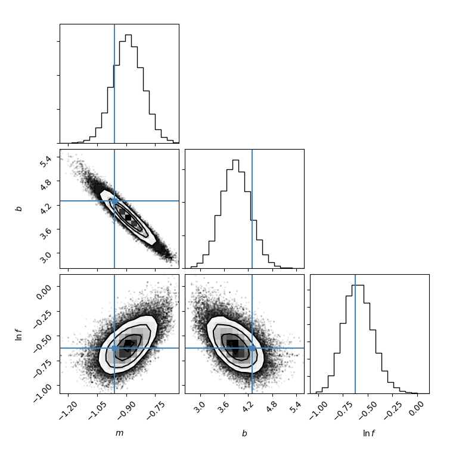

This is a simple implementation of Markov Chain Monte Carlo samplers. Two
algorithms are currently provided. They are mostly stolen from
[PyMC3](https://github.com/pymc-devs/pymc3).

- **Metropolis-Hastings**
```python
import mcmc
# just provide initial values (q0) and a function returning the log-probability
# (logp)
sampler = mcmc.sampler(q0, logp)
samples = sampler.sample(1000)
```



- **Sequential Monte Carlo**
```python
import smc
# just provide the prior PDF (x), the likelihood log-probability, and the prior
# log-probability
samples = smc(x, likelihood_logp, prior_logp)
```

# Install

`pip install git+https://github.com/davidbrochart/mcmc`

or clone this repository and `pip install -e mcmc`.
